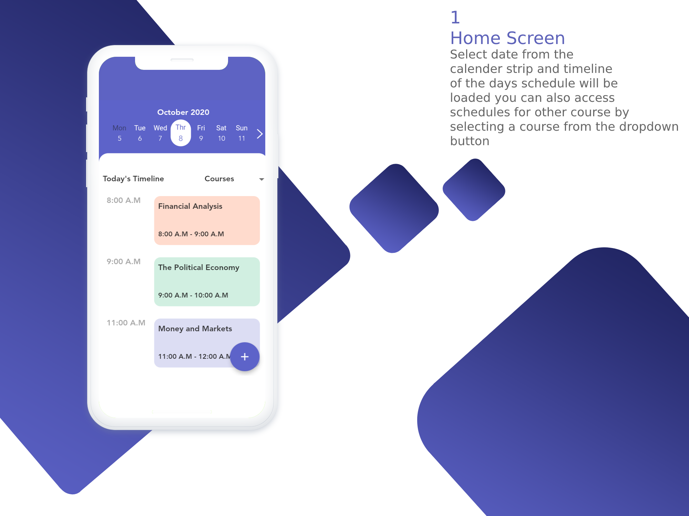

# Class Planner Mobile App

## Purpose of the App
Class planner is a mobile app that digitises the manual school timetable to better organise a students daily schedule by displaying list of lesson available on specific day based on course selected.  

## Target Audience
University students.

## Technology Stack and Platforms
This app uses flutter mobile ui framework for its frontend and firebase platform to store timetables of different courses.

## Target 
Android devices

## Features
Create notes, reminders on personal calendar
View timetables for different courses 

## Designs

